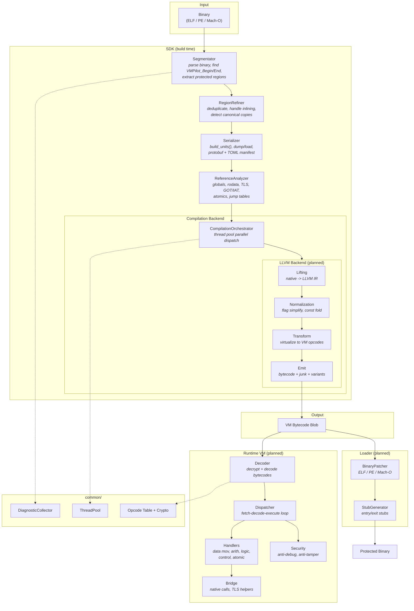

# VMPilot: A Modern C++ Virtual Machine SDK

VMPilot is an advanced virtual machine software development kit (SDK) implemented in C++. **Secure by design**, VMPilot is specifically engineered to safeguard your software from reverse engineering. Offering seamless integration and ease of use for your projects, VMPilot sets a new standard for software protection.

Unlike traditional black box solutions, VMPilot is built with transparency in mind. Its inner workings are easily understandable, yet formidable to crack. By incorporating modern cryptography and obfuscation techniques, your software is shielded against potential attacks. Even with the computing power of a supercomputer, breaking VMPilot in parallel becomes a daunting challenge.

## Usage

```cpp
#include <vmpilot/sdk.hpp>

template <typename T>
T square(T x) {
    VMPilot_Begin(__FUNCTION__);
    auto result = x * x;
    VMPilot_End(__FUNCTION__);
    return result;
}
```

Output:
```asm
square:
    push rbp
    call    _Z13VMPilot_BeginPKc    ; VMPilot_Begin(__FUNCTION__);
    ... garbage code ...
    ... garbage code ...
    ... garbage code ...
    call    _Z11VMPilot_EndPKc      ; VMPilot_End(__FUNCTION__);
    pop rbp
    ret
```

### Important: Compiler Optimization and Protected Regions

At `-O2`/`-O3`, the compiler may **reorder pure arithmetic** across
`VMPilot_Begin`/`VMPilot_End` boundaries, moving computation outside
the protected region. These markers are opaque function calls that act
as side-effect barriers, but the compiler is free to schedule
instructions that have no data dependency on the call.

To ensure all intended code stays inside the protected region, use a
compiler barrier:

```cpp
template <typename T>
T square(T x) {
    VMPilot_Begin(__FUNCTION__);
    asm volatile("" ::: "memory");  // GCC/Clang: prevent reordering
    auto result = x * x;
    asm volatile("" ::: "memory");
    VMPilot_End(__FUNCTION__);
    return result;
}
```

On MSVC, use `_ReadWriteBarrier()` for the same effect.

Additionally, mark protected functions with
`__attribute__((noinline))` (GCC/Clang) or `__declspec(noinline)`
(MSVC) to prevent the compiler from inlining them into callers, which
would create nested marker pairs.

## SDK Pipeline

```
binary (ELF / PE / Mach-O)
  |
  v
Segmentator::segment()          -- find VMPilot_Begin/End markers, extract regions
  |
  v
RegionRefiner::refine/group()   -- deduplicate, handle inlining, detect canonical copies
  |
  v
Serializer::build_units()       -- convert to CompilationUnits (single conversion point)
  |
  +-> Serializer::dump/load()   -- round-trip to protobuf + TOML manifest
  |
  v
CompilationOrchestrator         -- parallel compilation via work-stealing thread pool
  |   CompilerBackend::compile_unit()  (pluggable: SimpleBackend, future LLVM)
  v
CompilationResult               -- bytecodes + diagnostics
```

### Supported Platforms

| Format | Architecture | Segmentation | Reference Analysis |
|--------|-------------|-------------|-------------------|
| ELF    | x86, x86-64 | Yes | Yes |
| ELF    | ARM64       | Yes | Yes |
| PE     | x86, x86-64 | Yes | Yes |
| Mach-O | ARM64       | Yes | Yes |

### Key Components

| Component | Location | Purpose |
|-----------|----------|---------|
| Segmentator | `sdk/include/segmentator/` | Binary parsing, disassembly, region extraction |
| RegionRefiner | `sdk/include/region_refiner/` | Overlap removal, inline grouping, canonical detection |
| Serializer | `sdk/include/serializer/` | Protobuf serialization with `SerializationTraits<T>` |
| CompilerBackend | `sdk/include/bytecode_compiler/` | Strategy pattern for pluggable backends |
| ReferenceAnalyzer | `sdk/include/reference_analyzer/` | Data/TLS/GOT/atomic reference detection |
| DiagnosticCollector | `common/include/diagnostic_collector.hpp` | Unified thread-safe diagnostics across all stages |
| ThreadPool | `common/include/thread_pool.hpp` | Work-stealing pool for parallel compilation |

## Dependencies

- [CMake](https://cmake.org/download/) 3.20+
- C++17 compiler (GCC 14+, Clang 18+, MSVC 2022+, Apple Clang)

### Third-party (fetched automatically)

| Library | Purpose |
|---------|---------|
| [nlohmann/json](https://github.com/nlohmann/json) | JSON parsing (runtime config) |
| [VMPilot-crypto](https://github.com/scc-tw/VMPilot-crypto) | Common crypto (AES, SHA-256, BLAKE3) |
| [ELFIO](https://github.com/serge1/ELFIO) | ELF binary parsing |
| [COFFI](https://github.com/scc-tw/COFFI) | PE/COFF binary parsing |
| [capstone](https://github.com/capstone-engine/capstone) | Multi-arch disassembly |
| [protobuf](https://github.com/protocolbuffers/protobuf) | Serialization wire format |
| [spdlog](https://github.com/gabime/spdlog) | Logging |
| [toml++](https://github.com/marzer/tomlplusplus) | Manifest format |

### Optional

- [Ninja](https://github.com/ninja-build/ninja) (faster builds)

## Build

```bash
# Debug build with tests
git submodule update --init --recursive
cmake -B build -DCMAKE_BUILD_TYPE=Debug -DENABLE_TESTS=ON -G Ninja
cmake --build build -j
ctest --test-dir build --output-on-failure

# Release build
git submodule update --init --recursive
cmake -B build -DCMAKE_BUILD_TYPE=Release -G Ninja
cmake --build build -j
```

### Windows (MSVC)

```powershell
# Debug build with tests
git submodule update --init --recursive
cmake -B build -G "Visual Studio 17 2022" -A x64 -DENABLE_TESTS=ON
cmake --build build --config Debug -j
ctest --test-dir build -C Debug --output-on-failure

# Release build
git submodule update --init --recursive
cmake -B build -G "Visual Studio 17 2022" -A x64
cmake --build build --config Release -j
```

## Tools

| Tool | Usage | Purpose |
|------|-------|---------|
| `dump_regions` | `dump_regions <binary>` | Show segmentation groups and sites |
| `dump_compile` | `dump_compile <binary> [key]` | Full pipeline dump: segmentation, grouping, units, bytecodes |
| `verify_roundtrip` | `verify_roundtrip <binary>` | Verify serializer dump/load round-trip (exit 0 = pass) |

## CI

| Compiler | Status |
|----------|--------|
| MSVC 2022 | [](https://github.com/scc-tw/VMPilot/actions/workflows/msvc.yml) |
| GCC 14 | [](https://github.com/scc-tw/VMPilot/actions/workflows/gcc.yml) |
| Clang 18 | [](https://github.com/scc-tw/VMPilot/actions/workflows/clang.yml) |
| Apple Clang | [](https://github.com/scc-tw/VMPilot/actions/workflows/apple-clang.yml) |

## Roadmap

### Completed

- [x] **SDK Segmentator** -- ELF, PE, Mach-O parsing; x86, x86-64, ARM64 disassembly; VMPilot_Begin/End marker detection
- [x] **Region Refiner** -- overlap/containment removal, inline grouping, canonical copy detection
- [x] **Serializer** -- protobuf + TOML manifest, `SerializationTraits<T>`, round-trip dump/load
- [x] **Compilation Backend** -- work-stealing thread pool, pluggable `CompilerBackend` interface, SimpleBackend stub
- [x] **Reference Analyzer** -- globals, rodata, TLS, GOT/IAT, atomics, jump tables, scaled-index addressing
- [x] **Unified Diagnostics** -- `DiagnosticCollector` with thread-safe collection, `DiagnosticCode` enum, summary report
- [x] **CI/CD** -- MSVC, GCC, Clang, Apple Clang on GitHub Actions

### In Progress: LLVM Backend

The compilation backend will replace the `SimpleBackend` stub with a real native-to-VM-bytecode translator:

```
CompilationUnit (native code bytes)
  |
  v
Lifting         -- decode native insns, lift to LLVM IR (subset lifter + remill)
  |
  v
Normalization   -- simplify flags, fold constants from .rodata, guest memory AA
  |
  v
Transform       -- virtualize IR to VM opcodes, resolve data refs, encode jump tables
  |
  v
Emit            -- register allocation, bytecode emission, junk insertion, handler variants
  |
  v
VM Bytecode Blob
```

### Planned: Runtime VM

```
VM Bytecode Blob
  |
  v
Decoder         -- decrypt + decode bytecodes using opcode table
  |
  v
Dispatcher      -- fetch-decode-execute loop with handler dispatch
  |
  v
Handlers        -- data movement, arithmetic, logic, compare, control, atomic, width
  |
  v
Bridge          -- native call bridge (x86-64/ARM64 asm), TLS helpers
  |
  v
Security        -- anti-debug, anti-tamper, integrity checks
```

### Planned: Loader

```
Original Binary + VM Bytecode Blob
  |
  v
BinaryPatcher   -- patch original binary to redirect protected regions
  |   ELFPatcher / PEPatcher / MachOPatcher
  v
StubGenerator   -- emit entry/exit stubs that transfer control to VM runtime
  |
  v
Final Protected Binary
```

### Future File Structure

```text
common/
    include/
        diagnostic.hpp, diagnostic_collector.hpp
        instruction_t.hpp, opcode_enum.hpp, opcode_table.hpp
        thread_pool.hpp
        vm/                          <-- shared VM types (sdk + runtime)
            vm_insn.hpp, vm_opcode.hpp, vm_context.hpp
            vm_bytecode_blob.hpp, vm_config.hpp, vm_crypto.hpp

sdk/
    include/
        bytecode_compiler/
            CompilationOrchestrator.hpp, CompilerBackend.hpp
            compile_pipeline.hpp, LlvmBackend.hpp
            lifting/                 <-- native -> LLVM IR
                Decoder.hpp, Lifter.hpp, SubsetLifter.hpp
                RemillLifter.hpp, OpaqueEmitter.hpp, LiftResult.hpp
            normalization/           <-- LLVM IR cleanup
                NormalizePass.hpp, GuestMemoryAA.hpp
                ConstantFoldRodata.hpp, FlagSimplify.hpp
            transform/               <-- IR -> VM opcodes
                TransformPolicy.hpp, Virtualizer.hpp
                DataRefResolver.hpp, JumpTableEncoder.hpp
                NativeCallEncoder.hpp
            emit/                    <-- VM opcodes -> bytecode blob
                BytecodeEmitter.hpp, HandlerVariantSelector.hpp
                JunkInserter.hpp, RegisterAllocator.hpp
        reference_analyzer/
        core/
        segmentator/
        serializer/

runtime/
    include/
        decoder.hpp
        vm/
            vm_dispatcher.hpp, vm_handlers.hpp, vm_entry_exit.hpp
    src/
        vm/
            vm_dispatcher.cpp, vm_integrity.cpp
            handlers/                <-- one file per category
        bridge/
            native_call_bridge.cpp
            native_call_bridge_{x86_64,arm64}.S
            tls_helpers.cpp, tls_helpers_{x86_64,arm64}.S
        security/
            anti_debug.cpp, anti_tamper.cpp
        entry_exit/
            vm_{entry,exit}_{x86_64,arm64}.S

loader/
    include/
        BinaryPatcher.hpp, StubGenerator.hpp
        ELFPatcher.hpp, PEPatcher.hpp, MachOPatcher.hpp
    src/
        BinaryPatcher.cpp, StubGenerator.cpp
        ELFPatcher.cpp, PEPatcher.cpp, MachOPatcher.cpp
```

## Documentation

Please refer to [wiki](/wiki) for more information.

## Architecture


