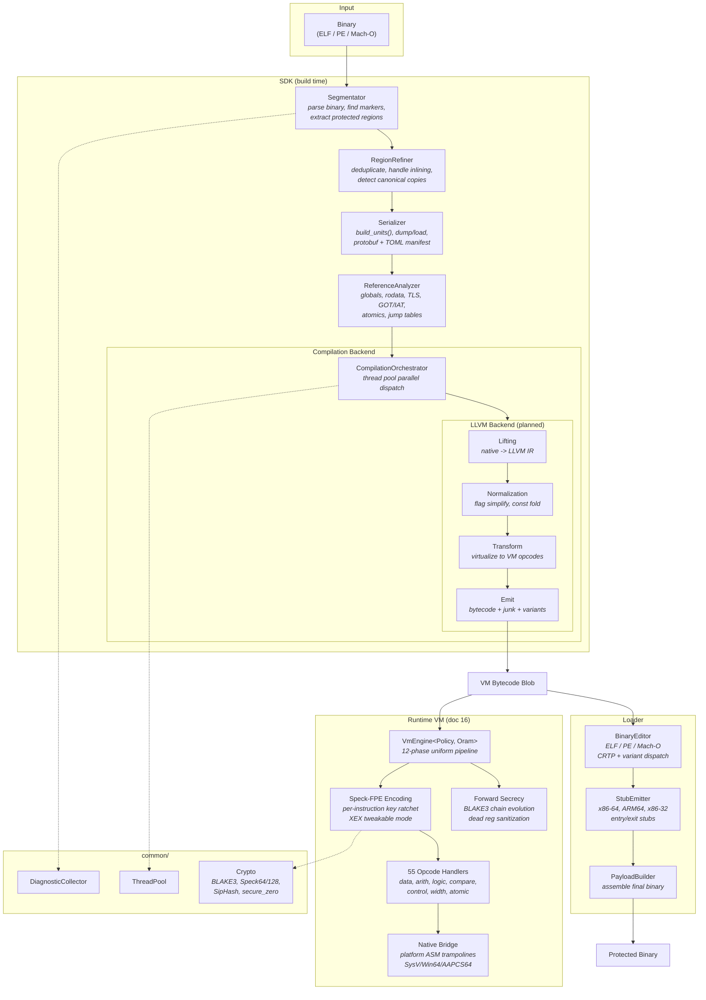

# VMPilot: A Modern C++ Virtual Machine SDK

VMPilot is an advanced virtual machine software development kit (SDK) implemented in C++. **Secure by design**, VMPilot is specifically engineered to safeguard your software from reverse engineering. Offering seamless integration and ease of use for your projects, VMPilot sets a new standard for software protection.

Unlike traditional black box solutions, VMPilot is built with transparency in mind. Its inner workings are easily understandable, yet formidable to crack. By incorporating modern cryptography and obfuscation techniques, your software is shielded against potential attacks. Even with the computing power of a supercomputer, breaking VMPilot in parallel becomes a daunting challenge.

## Usage

```cpp
#include <vmpilot/sdk.hpp>

template <typename T>
T square(T x) {
    VMPilot_Begin(__FUNCTION__);
    auto result = x * x;
    VMPilot_End(__FUNCTION__);
    return result;
}
```

Output:
```asm
square:
    push rbp
    call    _Z13VMPilot_BeginPKc    ; VMPilot_Begin(__FUNCTION__);
    ... garbage code ...
    ... garbage code ...
    ... garbage code ...
    call    _Z11VMPilot_EndPKc      ; VMPilot_End(__FUNCTION__);
    pop rbp
    ret
```

### Important: Compiler Optimization and Protected Regions

At `-O2`/`-O3`, the compiler may **reorder pure arithmetic** across
`VMPilot_Begin`/`VMPilot_End` boundaries, moving computation outside
the protected region. These markers are opaque function calls that act
as side-effect barriers, but the compiler is free to schedule
instructions that have no data dependency on the call.

To ensure all intended code stays inside the protected region, use a
compiler barrier:

```cpp
template <typename T>
T square(T x) {
    VMPilot_Begin(__FUNCTION__);
    asm volatile("" ::: "memory");  // GCC/Clang: prevent reordering
    auto result = x * x;
    asm volatile("" ::: "memory");
    VMPilot_End(__FUNCTION__);
    return result;
}
```

On MSVC, use `_ReadWriteBarrier()` for the same effect.

Additionally, mark protected functions with
`__attribute__((noinline))` (GCC/Clang) or `__declspec(noinline)`
(MSVC) to prevent the compiler from inlining them into callers, which
would create nested marker pairs.

## Architecture

VMPilot has three major components: **SDK** (build-time compilation), **Loader** (binary patching), and **Runtime** (VM execution engine).

### SDK Pipeline

```
binary (ELF / PE / Mach-O)
  |
  v
Segmentator::segment()          -- find VMPilot_Begin/End markers, extract regions
  |
  v
RegionRefiner::refine/group()   -- deduplicate, handle inlining, detect canonical copies
  |
  v
Serializer::build_units()       -- convert to CompilationUnits (single conversion point)
  |
  +-> Serializer::dump/load()   -- round-trip to protobuf + TOML manifest
  |
  v
CompilationOrchestrator         -- parallel compilation via work-stealing thread pool
  |   CompilerBackend::compile_unit()  (pluggable: SimpleBackend, future LLVM)
  v
CompilationResult               -- bytecodes + diagnostics
```

### Runtime VM (doc 16 forward-secrecy)

```
VM Bytecode Blob
  |
  v
VmEngine::create()              -- blob validation, key derivation, state init
  |
  v
step() pipeline (12 phases)     -- uniform per-instruction execution
  |   Phase A-C: fetch, decrypt (SipHash), decode (PRP)
  |   Phase D:   FPE decode operands (Speck64/128 XEX mode)
  |   Phase E:   handler dispatch (55 opcodes via compile-time table)
  |   Phase F-G: FPE encode result, key ratchet (BLAKE3 entangled)
  |   Phase H-I: dead register sanitization, stack hygiene
  |   Phase J-K: enc_state advance, IP/BB transition
  |   Phase L:   BB MAC verification, forward-secrecy chain evolution
  v
VmExecResult                    -- decoded return value
```

### Loader

```
Original Binary + VM Bytecode Blob
  |
  v
BinaryEditor                    -- CRTP + std::variant dispatch
  |   ELFEditor / PEEditor / MachOEditor
  v
StubEmitter                     -- emit entry/exit stubs per architecture
  |   X86_64 / ARM64 / X86_32
  v
PayloadBuilder                  -- assemble final protected binary
  |
  v
Protected Binary
```

### Supported Platforms

| Format | Architecture | SDK | Loader | Runtime |
|--------|-------------|-----|--------|---------|
| ELF    | x86-64      | Yes | Yes    | Yes     |
| ELF    | x86-32      | Yes | Yes    | Yes     |
| ELF    | ARM64       | Yes | Yes    | Yes     |
| PE     | x86-64      | Yes | Yes    | Yes     |
| PE     | x86-32      | Yes | Yes    | Yes     |
| Mach-O | ARM64       | Yes | Yes    | Yes     |

## Security Model

The runtime VM implements the **doc 16 forward-secrecy extension**:

- **Per-instruction FPE encoding** -- registers are encrypted with Speck64/128 in XEX mode; the key ratchets every instruction via `BLAKE3_KEYED(key, opcode || register_fingerprint)`
- **BB chain evolution** -- one-way BLAKE3 chain state updated on every basic block transition; compromising the current state reveals nothing about past states (preimage resistance >= 2^256)
- **Eager re-encoding** -- all 16 registers re-encoded on every BB transition; dead registers sanitized to `Enc(K_new, 0)` to prevent path-merge fingerprint desync
- **Stack hygiene** -- all intermediate key material (Speck round keys, XEX tweaks, plaintext temporaries) zeroed via `secure_zero()` after use
- **ORAM strategies** -- `RollingKeyOram` (full security) and `DirectOram` (fast testing) via compile-time policy selection

## Dependencies

- [CMake](https://cmake.org/download/) 3.20+
- C++17 compiler (GCC 14+, Clang 18+, MSVC 2022+, Apple Clang)
- [Ninja](https://github.com/ninja-build/ninja) (required on Linux/macOS; not needed for Windows `*-win` presets)

### Third-party

| Library | Type | Purpose |
|---------|------|---------|
| [Botan](https://github.com/randombit/botan) | submodule | Crypto backend (AES, SHA-256) |
| [BLAKE3](https://github.com/BLAKE3-team/BLAKE3) | submodule | Keyed hashing, key derivation |
| [abseil-cpp](https://github.com/abseil/abseil-cpp) | submodule | Core utilities (used by protobuf) |
| [protobuf](https://github.com/protocolbuffers/protobuf) | submodule | Serialization wire format |
| [capstone](https://github.com/capstone-engine/capstone) | submodule | Multi-arch disassembly |
| [tl::expected](https://github.com/TartanLlama/expected) | submodule | Error handling (C++17 backport) |
| [ELFIO](https://github.com/serge1/ELFIO) | CPM | ELF binary parsing |
| [COFFI](https://github.com/scc-tw/COFFI) | CPM | PE/COFF binary parsing |
| [spdlog](https://github.com/gabime/spdlog) | CPM | Logging |
| [toml++](https://github.com/marzer/tomlplusplus) | CPM | Manifest format |
| [GoogleTest](https://github.com/google/googletest) | FetchContent | Testing (dev only) |

## Build

### Using CMake Presets (recommended)

```bash
git submodule update --init --recursive

# Development (Debug + tests + ASan/UBsan)
cmake --preset dev
cmake --build --preset dev
ctest --preset dev

# Release (optimised + LTO)
cmake --preset release
cmake --build --preset release

# Other presets: reldbg, minsize, ci
cmake --list-presets    # show all available presets
```

### Windows (Visual Studio)

> **Note:** The `dev-win` preset enables AddressSanitizer (ASan), which
> requires the MSVC ASan runtime DLLs on `PATH`. Use **Visual Studio
> Developer PowerShell** (or `VsDevCmd.bat`) to ensure they are available.
> The `release-win` preset does not require this.

```powershell
git submodule update --init --recursive

cmake --preset dev-win
cmake --build --preset dev-win --parallel
ctest --preset dev-win

# Other presets: release-win, ci-win
```

### Manual (without presets)

```bash
git submodule update --init --recursive
cmake -B build -G Ninja -DCMAKE_BUILD_TYPE=Debug -DVMPILOT_ENABLE_TESTS=ON -DVMPILOT_ENABLE_SANITIZERS=ON
ninja -C build
ctest --test-dir build --output-on-failure
```

### CMake Options

| Option | Default | Description |
|--------|---------|-------------|
| `VMPILOT_ENABLE_TESTS` | OFF | Build test targets |
| `VMPILOT_ENABLE_SANITIZERS` | OFF | ASan + UBsan on first-party targets |
| `VMPILOT_ENABLE_LTO` | OFF | Link-time optimisation |

## Project Structure

```text
CMakeLists.txt                       Root build (includes cmake/ modules)
CMakePresets.json                    Preset configurations (dev, release, ci, ...)

cmake/
    Options.cmake                    Build type default, feature toggles
    CompilerWarnings.cmake           vmpilot_options INTERFACE (C++17, warnings)
    Sanitizers.cmake                 vmpilot_sanitizer INTERFACE (ASan+UBsan)
    LTO.cmake                        Link-time optimisation
    Dependencies.cmake               CPM packages, GoogleTest
    CPM.cmake                        CPM v0.42.1 bootstrap
    SuppressThirdPartyWarnings.cmake Per-target warning suppression

common/
    include/
        diagnostic.hpp               Diagnostic codes and severity levels
        diagnostic_collector.hpp     Thread-safe diagnostic collection
        thread_pool.hpp              Work-stealing thread pool
        opcode_table.hpp             VM opcode definitions
        vm/
            vm_context.hpp           BBMetadata, EpochCheckpoint, constants
            vm_blob.hpp              Bytecode blob format and validation
            vm_insn.hpp              Instruction encoding (8-byte packed)
            vm_opcode.hpp            55 VM opcodes across 7 categories
            vm_crypto.hpp            BLAKE3 keyed hashing, SipHash
            vm_encoding.hpp          Per-BB LUT derivation, RE_TABLE
            encoded_value.hpp        Phantom types: Encoded<Domain>
            blob_view.hpp            Type-safe non-owning blob access
            speck64.hpp              Speck64/128 block cipher (27 rounds)
            xex_speck64.hpp          XEX tweakable mode, FPE_Encode/Decode
            secure_zero.hpp          explicit_bzero + SecureLocal<T> RAII
            hardware_rng.hpp         RDRAND / RNDR / fallback RNG
    src/
        vm/vm_crypto.cpp             blake3_keyed_128, blake3_keyed_fingerprint
        vm/vm_encoding.cpp           derive_register_tables, derive_re_tables
        vm/hardware_rng_{linux,darwin,windows}.cpp
    crypto/                          Botan/OpenSSL backend + BLAKE3

runtime/
    include/
        vm_engine.hpp                VmEngine<Policy, Oram> — 12-phase pipeline
        vm_state.hpp                 4-way state split: Immutable/Execution/Epoch/Oram
        vm_policy.hpp                DebugPolicy, StandardPolicy, HighSecPolicy
        handler_impls.hpp            55 opcode handlers via HandlerTraits<Op, Policy>
        handler_traits.hpp           CRTP handler dispatch + compile-time table
        pipeline.hpp                 fetch/decrypt/decode, enter_basic_block, verify_mac
        oram_strategy.hpp            RollingKeyOram, DirectOram
        platform_call.hpp            PlatformCallDesc, ABI classification
        decoded_insn.hpp             Decoded instruction with plaintext operands
        vm_runner.hpp                VmRunner<Policy> factory + StepController
        native_registry.hpp          Name-based native function registry
        program_builder.hpp          Fluent ProgramBuilder DSL
        blob_builder.hpp             Unified blob construction (FPE-encoded)
    src/
        pipeline.cpp                 enter_basic_block (FPE re-encode + chain evolution)
        vm_state.cpp                 State initialisation and key derivation
        oram_strategies.cpp          ORAM read/write implementations
        classify_args.cpp            ABI argument classification
        tls_helpers.cpp              Thread-local storage access
        platform_call_x86_64.S       SysV x86-64 trampoline (>6 args, FP, stack)
        platform_call_arm64.S        AAPCS64 trampoline
        platform_call_win64.S        Win64 ABI trampoline (GAS)
        platform_call_x86_32.S       cdecl + stdcall trampoline
        platform_call_win64.asm      Win64 ABI trampoline (MASM)
        platform_call_x86_32.asm     x86-32 trampoline (MASM)
        bridge/
            native_call_bridge_x86_64.S
            native_call_bridge_arm64.S
        entry_exit/
            vm_entry_x86_64.S, vm_exit_x86_64.S
            vm_entry_arm64.S, vm_exit_arm64.S
    test/                            243 tests across 20 binaries
    example/
        hello_world.cpp              NATIVE_CALL to puts()
        arithmetic.cpp               ADD/SUB/MUL/DIV
        verify_signature.cpp         BLAKE3-KEYED MAC verification
        snake.cpp                    2D terminal game (step() cooperative loop)

loader/
    include/
        BinaryEditor.hpp             Abstract base (CRTP)
        editor_base.hpp              CRTP dispatch helpers
        ELFEditor.hpp                ELF section extension, segment manipulation
        PEEditor.hpp                 PE section injection
        MachOEditor.hpp              Mach-O load command editing
        StubEmitter.hpp              Architecture-dispatched stub generation
        PayloadBuilder.hpp           Bytecode blob + stub assembly
        fallback_chain.hpp           FallbackChain<Strategy...> for dep resolution
        strategies/
            elf_dep_strategies.hpp   RPATH, RUNPATH, LD_LIBRARY_PATH
            pe_dep_strategies.hpp    SxS manifest, PATH, app-local
            macho_dep_strategies.hpp @rpath, @loader_path, install_name_tool
    src/
        ELFEditor.cpp, PEEditor.cpp, MachOEditor.cpp
        StubEmitter.cpp, X86_64StubEmitter.cpp, ARM64StubEmitter.cpp, X86_32StubEmitter.cpp
        PayloadBuilder.cpp, BinaryEditor.cpp, Loader.cpp
        strategies/
            elf_dep_strategies.cpp, pe_dep_strategies.cpp, macho_dep_strategies.cpp
    tests/                           Handover, patch E2E, editor permissions

sdk/
    include/
        segmentator/                 Binary parsing, region extraction
        region_refiner/              Dedup, inline grouping, canonical detection
        serializer/                  Protobuf + TOML manifest
        bytecode_compiler/           CompilationOrchestrator, pluggable backends
        reference_analyzer/          Data/TLS/GOT/atomic reference detection
        arch_handler/                X86 + ARM64 disassembly traits
        capstone_wrapper/            C++ wrapper around capstone
        core/                        CompilationUnit, DataReference, Section
        file_handler/                ELF/PE/Mach-O file handlers
    src/
        segmentator/                 HandlerRegistry, segmentator
        bytecode_compiler/           CompilationOrchestrator, compile pipeline
        reference_analyzer/          SymExpr, MemoryModel, layers, traits
        serializer/                  SerializationTraits, protobuf codegen
        capstone_wrapper/            capstone C++ bindings
        region_refiner/              RegionRefiner
        arch_handler/                X86Handler, ARM64Handler
        file_handler/                ELFHandler, PEHandler, MachOHandler

third_party/                         Git submodules
    abseil-cpp/                      LTS 2026-01-07
    protobuf/                        v5.34.0
    capstone/                        Disassembly engine
    expected/                        tl::expected (C++17 backport)
```

## Tools

| Tool | Usage | Purpose |
|------|-------|---------|
| `dump_regions` | `dump_regions <binary>` | Show segmentation groups and sites |
| `dump_compile` | `dump_compile <binary> [key]` | Full pipeline dump: segmentation, grouping, units, bytecodes |
| `verify_roundtrip` | `verify_roundtrip <binary>` | Verify serializer dump/load round-trip (exit 0 = pass) |

## CI

| Compiler | Status |
|----------|--------|
| MSVC 2022 | [](https://github.com/scc-tw/VMPilot/actions/workflows/msvc.yml) |
| GCC 14 | [](https://github.com/scc-tw/VMPilot/actions/workflows/gcc.yml) |
| Clang 18 | [](https://github.com/scc-tw/VMPilot/actions/workflows/clang.yml) |
| Apple Clang | [](https://github.com/scc-tw/VMPilot/actions/workflows/apple-clang.yml) |

## Roadmap

### Completed

- [x] **SDK Segmentator** -- ELF, PE, Mach-O parsing; x86, x86-64, ARM64 disassembly; VMPilot_Begin/End marker detection
- [x] **Region Refiner** -- overlap/containment removal, inline grouping, canonical copy detection
- [x] **Serializer** -- protobuf + TOML manifest, `SerializationTraits<T>`, round-trip dump/load
- [x] **Compilation Backend** -- work-stealing thread pool, pluggable `CompilerBackend` interface, SimpleBackend stub
- [x] **Reference Analyzer** -- globals, rodata, TLS, GOT/IAT, atomics, jump tables, scaled-index addressing
- [x] **Unified Diagnostics** -- `DiagnosticCollector` with thread-safe collection, `DiagnosticCode` enum, summary report
- [x] **Loader** -- ELF/PE/Mach-O editors with CRTP dispatch, stub emitters (x86-64, ARM64, x86-32), PayloadBuilder, FallbackChain dependency strategies
- [x] **Runtime VM** -- doc 16 forward-secrecy engine: Speck-FPE register encoding, BLAKE3 key ratchet, 55 opcodes, ORAM strategies, platform ASM trampolines (SysV x64, Win64, AAPCS64, cdecl/stdcall)
- [x] **CI/CD** -- MSVC, GCC, Clang, Apple Clang on GitHub Actions
- [x] **Modern CMake** -- presets, modular cmake/ includes, per-target sanitizers, CPM 0.42.1

### In Progress

- [ ] **LLVM Backend** -- replace SimpleBackend stub with native-to-VM-bytecode translator (lifting, normalization, transform, emit)
- [ ] **Test coverage expansion** -- 829 tests currently; targeting full opcode + edge-case coverage

### Planned

- [ ] **Doc 17 rolling-state decryption** -- cloud-forged state-dependent bytecode encryption
- [ ] **SAVE_EPOCH/RESYNC v2** -- AEAD with ChaCha20-Poly1305 for snapshot integrity (requires hardware-bound key or accepts MATE limitation)

## Documentation

Please refer to [wiki](/wiki) for more information.

## Architecture


